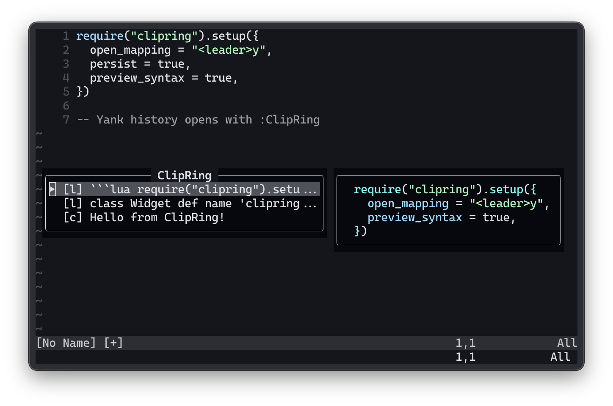
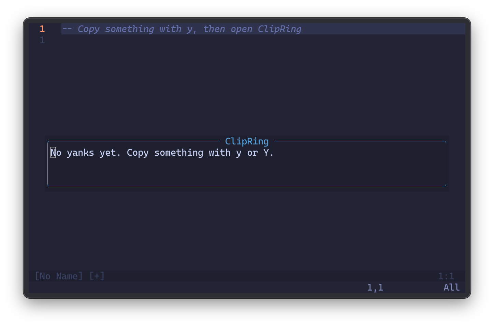

# clipring.nvim

[](https://github.com/alexesba/clipring.nvim/actions/workflows/test.yml)
[](LICENSE)

Minimal yank history for Neovim — a lightweight Lua plugin inspired by YankRing and Windows Clipboard History. No required dependencies — works with any Neovim setup (LazyVim, packer, plain Lua config). Treesitter and which-key are optional extras, not requirements.

**Repository:** [github.com/alexesba/clipring.nvim](https://github.com/alexesba/clipring.nvim)

## Screenshots





## Features

- Automatic capture of every yank
- Floating popup history (`:ClipRing`) with an auto-sizing multiline preview pane
- Preview pane shown only when there is content to display; optional syntax highlighting for code
- Navigate with `j` / `k`, reorder with `<C-j>` / `<C-k>`, paste with `<Enter>`, copy to the system clipboard with `y`, delete with `dd`
- Works from Normal, Insert, and Visual modes
- Optional JSON persistence between sessions
- Configurable history size and keymaps

## Requirements

- Neovim 0.9+

## Installation

With [lazy.nvim](https://github.com/folke/lazy.nvim):

```lua
{
  "alexesba/clipring.nvim",
  config = function()
    require("clipring").setup({
      max_entries = 100,
      persist = true,
      open_mapping = "<leader>y",
    })
  end,
}
```

With [packer.nvim](https://github.com/wbthomason/packer.nvim):

```lua
use({ "alexesba/clipring.nvim", config = function() require("clipring").setup() end })
```

With a minimal `lazy.nvim` / `packer.nvim` setup, Neovim loads the plugin from `lua/clipring/` automatically after install.

**Important:** call `require("clipring").setup()` to enable yank capture and optional persistence. The `:ClipRing` command is registered without `setup`, but the ring stays empty until you configure it.

## Usage

### Open the picker

| How | When |
|-----|------|
| `:ClipRing` | Always available (no keymap required) |
| Your `open_mapping` | After you set one in `setup()` (e.g. `<leader>y`) |

The picker opens as two side-by-side floats when there are yanks to show: a **history list** (height follows entry count) and a **preview pane** that resizes to fit the selected entry. Code yanks are syntax-highlighted when ClipRing can detect a language (markdown ` ```lang ` fences, shebangs, or simple heuristics). With an empty ring, only the list is shown.

### Inside the picker

| Key | Action |
|-----|--------|
| `j` / `k` or `J` / `K` | Move selection up / down |
| `<Up>` / `<Down>` | Same as `k` / `j` |
| `<C-j>` / `<C-k>` | Move the **selected entry** down / up in history order (reorder) |
| `<Enter>` | Paste the selected entry and close |
| `y` | Copy the selected entry to the system clipboard (`+` / `*`) and keep the picker open |
| `dd` | Delete the selected entry from history |
| `q` or `<Esc>` | Close without pasting |

While the picker is focused, `<C-w>` does not switch windows or open which-key (close the picker first, like Telescope). Keys apply to the history list; the preview pane is read-only. If you use [which-key.nvim](https://github.com/folke/which-key.nvim), `setup()` disables which-key on the history list buffer (`clipring` filetype).

### Paste behavior by mode

**Normal** — Pastes at the cursor position when you opened the picker. Linewise and charwise entries use the saved position (including end-of-line and empty lines).

**Insert** — Pastes at the cursor without leaving Insert mode. Trailing spaces and end-of-file positions are preserved.

**Visual** — Replaces the current visual selection with the chosen entry. Open ClipRing **while still in visual mode** so the selection is captured; stale `'<` / `'>` marks from an earlier visual session are ignored when you open from Normal mode.

### Typical workflow

1. Yank text as usual (`y`, `yy`, visual yank, etc.).
2. Open ClipRing (`:ClipRing` or your mapping).
3. Use `j` / `k` to highlight an entry, optionally `<C-j>` / `<C-k>` to reorder favorites.
4. Press `<Enter>` to paste, `y` to copy to the system clipboard without pasting, or `q` to cancel.

With `persist = true`, history is restored after you restart Neovim (stored under `persist_path`).

## Configuration

```lua
require("clipring").setup({
  -- Ring
  max_entries = 100,
  persist = false,
  persist_path = vim.fn.stdpath("data") .. "/clipring/history.json",
  deduplicate = true,

  -- Open & picker keys
  open_mapping = "<leader>y",
  reorder_down_mapping = "<C-j>",
  reorder_up_mapping = "<C-k>",
  copy_mapping = "y",

  -- Layout (list and preview auto-size within these limits)
  picker_width = 80,        -- total inner width; 0 = nearly full editor width
  picker_max_height = 18,   -- max height for list and preview
  preview_max_lines = 16,   -- max lines per entry in the preview pane
  preview_syntax = true,    -- highlight code in the preview when a language is detected
})
```

**`open_mapping`** — set a string (e.g. `"<leader>y"`) or multiple (`{ "<leader>y", "<M-y>" }`) to open ClipRing from Normal, Visual, and Insert. Leave unset or `nil` to use only `:ClipRing`. Use `false` to clear a keymap after a previous `setup()`.

Omit `reorder_down_mapping` / `reorder_up_mapping` / `copy_mapping` to keep the defaults above. Set any of them to `false` to turn off that binding.

Copy uses Neovim’s `+` and `*` registers (and the unnamed `"` register). You need clipboard support in Neovim (`:checkhealth clipboard`); on remote SSH, OSC52 or a clipboard provider may be required.

If `<C-j>` / `<C-k>` conflict with global maps (e.g. `:move`), use different keys: `reorder_down_mapping = "<A-j>"`.

**Preview syntax** — when `preview_syntax` is true (default), ClipRing detects a language from markdown ` ```lang ` fences, shebangs, Neovim’s filetype match, or simple heuristics, then highlights with built-in Vim syntax. If Treesitter parsers are installed, highlighting may look better; set `preview_syntax = false` for plain text only. Fence markers are stripped from the preview — only the code body is shown.

### Advanced

```lua
require("clipring").setup({
  min_length = 1,             -- ignore yanks shorter than this (chars)
  preview_length = 80,        -- max chars in each one-line list label
  preview_max_width = 120,    -- cap preview width; 0 = up to screen edge (default)
  list_width = 0,             -- fixed list width in columns; 0 = auto (recommended)
})
```

## Tests

Specs run on every push to `main` and on pull requests via [GitHub Actions](https://github.com/alexesba/clipring.nvim/actions/workflows/test.yml).

Locally, tests use [plenary.nvim](https://github.com/nvim-lua/plenary.nvim) inside headless Neovim:

```bash
git clone https://github.com/alexesba/clipring.nvim.git
cd clipring.nvim
./scripts/run_tests.sh
```

Set `PLENARY_DIR` if plenary is already on disk:

```bash
PLENARY_DIR=~/.local/share/nvim/lazy/plenary.nvim ./scripts/run_tests.sh
```

To regenerate README screenshots, see [doc/screenshots/README.md](doc/screenshots/README.md).

Coverage today:

- **ring** — add, dedupe, max size, remove, reorder
- **preview_syntax** — fence stripping, language detection, heuristics
- **paste** — visual capture (`v` / `'<`), charwise replace vs append, insert-mode paste at saved cursor
- **ui** — picker from insert, navigation, reorder keys, auto-size layout, conditional preview, multiline preview, syntax highlighting, clipboard copy, which-key / `<C-w>` behavior
- **yank** — `TextYankPost` capture
- **setup** — `open_mapping` registration

## Roadmap

Possible future work: Telescope picker, bulk delete.

## License

MIT
